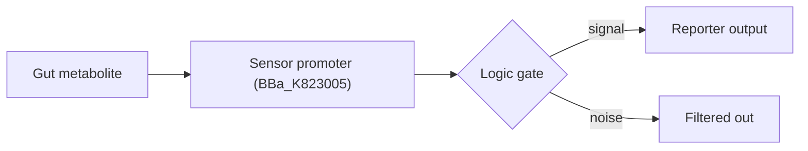
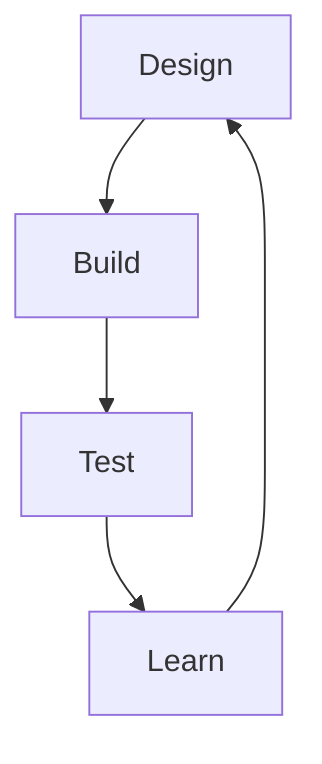
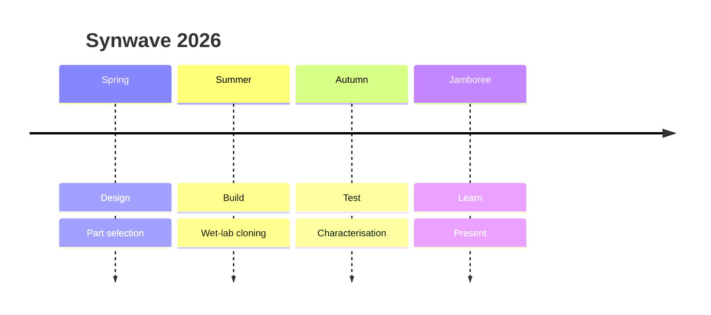
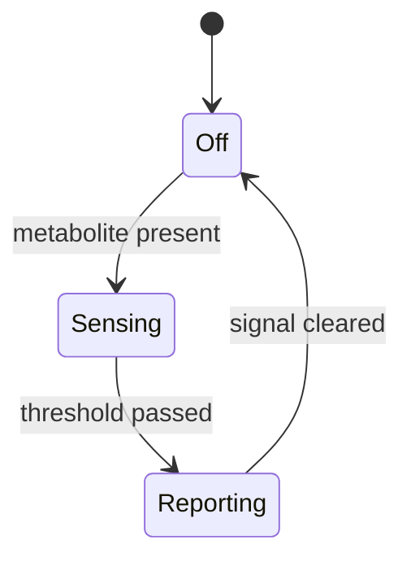

import Tabs from '@theme/Tabs';
import TabItem from '@theme/TabItem';
import TOCInline from '@theme/TOCInline';
import React, {useState} from 'react';
import {subteams} from '@site/src/data/team';
import od600 from '@site/src/data/od600.json';
import GrowthChart from '@site/src/components/GrowthChart';
import {Cite, Bibliography} from '@site/src/components/Cite';
import GrowthProtocol from './_snippets/_growth-protocol.mdx';

# The Power of MDX

MDX = **Markdown + JSX**. Plain prose where you want it, real React components where
you need them. Below: one example of each feature worth using on this wiki. This whole
page is itself an `.mdx` file — view source to copy any pattern.

---

## 1. Markdown basics

**Bold**, _italic_, `inline code`, [a link](/docs/description), and lists:

- gut–brain axis
- biosensor
- early detection

> Blockquotes work too.

---

## 2. Admonitions (callouts)

Five flavours (`note`, `tip`, `info`, `warning`, `danger`), optional custom title in
`[brackets]`:

:::tip[Use these everywhere]
Great for protocols, gotchas, and medal-criteria notes.
:::

:::danger[Biosafety alert]
Reserve for genuine biosafety warnings and handling of hazardous reagents
(e.g. ethidium bromide).
:::

---

## 3. Code blocks — title + line highlighting

```python title="biosensor_model.py" {3-4} showLineNumbers
import numpy as np

def hill(L, Kd, n):           # highlighted
    return L**n / (Kd**n + L**n)   # highlighted

signal = hill(np.linspace(0, 10, 100), Kd=2.0, n=2)
```

---

## 4. Tabs

Great for the same protocol across different chassis, or different experimental conditions.

```mdx
<Tabs> <TabItem value="x" label="X">…</TabItem> </Tabs>
```

<Tabs>
  <TabItem value="ecoli" label="E. coli" default>
    Standard lab chassis — fast, well-characterised.
  </TabItem>
  <TabItem value="bsub" label="B. subtilis">
    Gram-positive, good secretion, spore-forming.
  </TabItem>
</Tabs>

---

## 5. Collapsible details

:::warning[MDX gotcha]
Always leave a **blank line after `<summary>`** (and before `</details>`), or the
Markdown inside won't parse — the list below would render as one flat line.
:::

<details>
  <summary>Click to expand a protocol step</summary>

  1. Inoculate 5 mL LB + antibiotic.
  2. Grow overnight at 37 °C, 200 rpm.
  3. Sub-culture 1:100, induce at OD₆₀₀ ≈ 0.4.

</details>

---

## 6. Mermaid diagrams

Fenced ` ```mermaid ` blocks render as diagrams — perfect for genetic circuits and
the DBTL cycle.

:::warning[Escape your parentheses]
Mermaid crashes the build on bare `(` `)` `[` inside node text. Wrap the label in
quotes: `A["Promoter (BBa_K823005)"]`.
:::





---

## 7. Math with KaTeX

Inline: the Hill equation gives fractional occupancy $\theta = \frac{L^n}{K_d^n + L^n}$.

Block:

$$
v = \frac{V_{max}\,[S]}{K_m + [S]}
$$

---

## 8. Custom inline badges

A tiny reusable component beats plain text for status, ownership, or medal tracking.
Define once, use anywhere on the page:

export const Badge = ({children, color = 'var(--ifm-color-primary)', text = '#0C1036'}) => (
  <span style={{
    background: color, color: text, borderRadius: 4, padding: '0.15rem 0.5rem',
    fontWeight: 700, fontSize: '0.78em', fontFamily: 'IBM Plex Mono, monospace',
    verticalAlign: 'middle',
  }}>{children}</span>
);

Wet Lab <Badge color="#C79233" text="#fff">In Progress</Badge> &nbsp;
Dry Lab <Badge color="#2EA043" text="#fff">Completed</Badge> &nbsp;
Tracking <Badge>Gold Medal</Badge>

---

## 9. Live React component (the real superpower)

Define a component with state and drop it inline. Try the slider:

export const HillDemo = () => {
  const [n, setN] = useState(2);
  const Kd = 2;
  const L = 3;
  const theta = (L ** n) / (Kd ** n + L ** n);
  return (
    <div style={{
      border: '1px solid var(--ifm-color-primary)', borderRadius: 12, padding: '1rem 1.25rem',
      background: 'var(--ifm-background-surface-color)', color: 'var(--ifm-font-color-base)',
      fontFamily: 'IBM Plex Mono, monospace',
    }}>
      <label>Hill coefficient n = <strong style={{color: 'var(--ifm-color-primary)'}}>{n}</strong></label>
      <input type="range" min={1} max={6} value={n}
        onChange={(e) => setN(Number(e.target.value))}
        style={{display: 'block', width: '100%', marginTop: 8, accentColor: 'var(--ifm-color-primary)'}} />
      <p style={{marginTop: 12, marginBottom: 0}}>
        occupancy θ at [L]=3, K<sub>d</sub>=2 →{' '}
        <strong style={{color: 'var(--ifm-color-primary)'}}>{theta.toFixed(3)}</strong>
      </p>
    </div>
  );
};

<HillDemo />

---

## 10. Inline vs external components

The two widgets above are **defined inline** with `export const` — fine for one-offs.
For anything reused across pages (a `<PartCard>`, a `<Figure>`), put it in
`src/components/` and import it. Keeps the prose readable and the component testable:

```mdx
// Recommended for anything reused — import from src/components/:
import HillDemo from '@site/src/components/HillDemo';

<HillDemo />

// Or define inline in the .mdx itself — good for a single throwaway widget:
export const HillDemo = () => { /* ...JSX... */ };

<HillDemo />
```

:::tip
You don't need `import React` for plain JSX — Docusaurus injects it. You **do** need
`import {useState}` (and friends) when a component uses hooks.
:::

---

## 11. Rich tables

Markdown tables accept inline JSX, so drop badges, links, or `<code>` into cells:

| Subteam | Task | Status |
| --- | --- | --- |
| **Wet Lab** | Cloning & assembly | <Badge color="#C79233" text="#fff">In Progress</Badge> |
| **Dry Lab** | Kinetic model | <Badge color="#2EA043" text="#fff">Completed</Badge> |
| **Human Practices** | Clinician interviews | <Badge color="#8B6522" text="#fff">Planned</Badge> |

---

## 12. Data-driven content

JavaScript expressions run at build time. Pull from `src/data/team.js` — single source
of truth, no copy-paste:

<ul>
  {subteams.map((t) => (
    <li key={t.name}><strong>{t.name}</strong> — {t.members.length} members</li>
  ))}
</ul>

---

## 13. Frontmatter

The block at the very top of this file sets the title, sidebar label/position,
`description`, and `keywords` (SEO + social cards). Every doc page supports it.

---

## 14. Embedded table of contents

`<TOCInline>` drops this page's heading tree anywhere — handy at the top of long
protocols. The `toc` variable is injected into every MDX file automatically:

<TOCInline toc={toc} maxHeadingLevel={2} />

---

## 15. Footnotes

Markdown footnotes are built in (GFM). Write `[^id]` inline and define it anywhere:[^medal]

[^medal]: iGEM medal criteria reward documented, reproducible work — footnotes keep prose clean while staying rigorous.

---

## 16. Author–year citations from a data file

Footnotes are great for asides; for a real bibliography keep references in
`src/data/references.js` and cite by key. One source of truth, auto-linked:

The Hill equation <Cite id="hill1910" /> and Michaelis–Menten kinetics
<Cite id="michaelis1913" /> underpin our dose–response model; medal rules are
defined by iGEM <Cite id="igem2026" />.

**References**

<Bibliography ids={['hill1910', 'michaelis1913', 'igem2026']} />

---

## 17. Reusable MDX partials

Write a snippet once in `docs/_snippets/` (leading underscore = not its own page),
then `import` it into any page. Edit once, updates everywhere:

```mdx
import GrowthProtocol from './_snippets/_growth-protocol.mdx';

<GrowthProtocol />
```

<GrowthProtocol />

---

## 18. Globally-registered components (no import)

Components listed in `src/theme/MDXComponents.js` work in **every** `.md`/`.mdx`
with no per-file import. This wiki registers `<Kbd>` and `<Part>` — used here with
zero imports on this page:

Press <Kbd>Ctrl</Kbd> + <Kbd>K</Kbd> to search. Our reporter uses <Part>BBa_K823005</Part>
(click it — links straight to the iGEM Registry).

:::tip
Reserve the global registry for components used across many pages. Keep one-off
widgets as inline `export const` (sections 8–9) so the prose stays readable.
:::

---

## 19. Real charts from data (recharts)

`HillDemo` (section 9) is hand-rolled; for genuine plots use a chart library.
`src/components/GrowthChart.jsx` reads `src/data/od600.json` and renders with
**recharts** (the only added runtime dependency — `pnpm add recharts`). Wrapped in
`<BrowserOnly>` so it doesn't break the static build:

<GrowthChart />

---

## 20. Data-driven tables

The same JSON drives a table — no copy-paste, no drift. Edit `od600.json`, both the
chart above and this table update:

<table>
  <thead>
    <tr><th>time (h)</th><th>WT OD₆₀₀</th><th>ΔsensorR OD₆₀₀</th></tr>
  </thead>
  <tbody>
    {od600.filter((r) => r.time % 4 === 0).map((r) => (
      <tr key={r.time}><td>{r.time}</td><td>{r.wt.toFixed(2)}</td><td>{r.mutant.toFixed(2)}</td></tr>
    ))}
  </tbody>
</table>

---

## 21. Zero-dependency interactive plot (SVG)

You don't always need a chart library. This live Hill curve is a plain inline `<svg>`
that recomputes as you drag — pure React, no packages:

export const HillCurve = () => {
  const [n, setN] = useState(2);
  const Kd = 2, W = 320, H = 140, pad = 4, Lmax = 8;
  const pts = Array.from({length: 60}, (_, i) => {
    const L = (i / 59) * Lmax;
    const theta = (L ** n) / (Kd ** n + L ** n);
    return [pad + (L / Lmax) * (W - 2 * pad), H - pad - theta * (H - 2 * pad)];
  });
  const d = pts.map((p, i) => (i ? 'L' : 'M') + p[0].toFixed(1) + ' ' + p[1].toFixed(1)).join(' ');
  return (
    <div style={{border: '1px solid var(--ifm-color-primary)', borderRadius: 12, padding: '1rem 1.25rem', background: 'var(--ifm-background-surface-color)'}}>
      <label style={{fontFamily: 'IBM Plex Mono, monospace'}}>n = <strong style={{color: 'var(--ifm-color-primary)'}}>{n}</strong></label>
      <input type="range" min={1} max={6} value={n} onChange={(e) => setN(Number(e.target.value))}
        style={{display: 'block', width: '100%', margin: '8px 0', accentColor: 'var(--ifm-color-primary)'}} />
      <svg width="100%" viewBox={`0 0 ${W} ${H}`} style={{display: 'block'}}>
        <path d={d} fill="none" stroke="var(--ifm-color-primary)" strokeWidth={2} />
      </svg>
    </div>
  );
};

<HillCurve />

---

## 22. Quiz / self-check widget

Outreach and education pages love these — pure React state, fully static:

export const Quiz = () => {
  const [pick, setPick] = useState(null);
  const correct = 'axis';
  const opts = [['axis', 'The gut–brain axis'], ['random', 'Random chance'], ['none', 'Nothing']];
  return (
    <div style={{border: '1px solid var(--ifm-color-primary)', borderRadius: 12, padding: '1rem 1.25rem', background: 'var(--ifm-background-surface-color)'}}>
      <p style={{marginTop: 0, fontWeight: 700}}>What does our biosensor read?</p>
      {opts.map(([v, label]) => (
        <button key={v} onClick={() => setPick(v)}
          style={{display: 'block', width: '100%', textAlign: 'left', margin: '4px 0', padding: '0.5rem 0.75rem', borderRadius: 8, cursor: 'pointer',
            border: '1px solid ' + (pick === v ? 'var(--ifm-color-primary)' : 'rgba(232,236,247,0.25)'),
            background: pick === v ? 'rgba(240,197,129,0.12)' : 'transparent', color: 'var(--ifm-font-color-base)'}}>
          {label}
        </button>
      ))}
      {pick && <p style={{marginBottom: 0, color: pick === correct ? '#2EA043' : 'var(--ifm-color-danger)'}}>
        {pick === correct ? '✓ Correct!' : '✗ Try again.'}</p>}
    </div>
  );
};

<Quiz />

---

## 23. Media embeds

Any `<iframe>` works, so a video is a one-liner. **But iGEM requires every video
to be hosted on [iGEM Video Universe](https://video.igem.org)** — not YouTube,
Vimeo or any other third-party host. Upload the video there first, copy its embed
URL, and paste it in as `src`:

```jsx
<div style={{position: 'relative', paddingBottom: '56.25%', height: 0, borderRadius: 12, overflow: 'hidden'}}>
  <iframe src="https://video.igem.org/videos/embed/<YOUR-VIDEO-ID>"
    title="Synwave project video" allowFullScreen
    style={{position: 'absolute', top: 0, left: 0, width: '100%', height: '100%', border: 0}} />
</div>
```

The example is shown as a code block rather than a live embed because there is no
uploaded video to point it at yet — replace `<YOUR-VIDEO-ID>` and unwrap it.

:::tip
For a nicer API (lazy-load, many providers) `pnpm add react-player` and import it —
but a plain `<iframe>` keeps the build dependency-free.
:::

---

## 24. Bigger superpowers (opt-in installs)

These need a package or config change. Patterns below are copy-paste ready — they're
**documented, not yet installed**, to keep the build lean. Add the ones you need:

<Tabs>
  <TabItem value="search" label="Offline search" default>

Local, server-free search (no Algolia account):

```bash
pnpm add @easyops-cn/docusaurus-search-local
```
```ts title="docusaurus.config.ts"
themes: [
  '@docusaurus/theme-mermaid',
  [require.resolve('@easyops-cn/docusaurus-search-local'), {hashed: true, indexBlog: true}],
],
```
Note: the index builds on `pnpm build`, not `pnpm start`.

  </TabItem>
  <TabItem value="seq" label="Sequence viewer">

Plasmid maps / DNA in the browser with [seqviz](https://github.com/Lattice-Automation/seqviz):

```bash
pnpm add seqviz
```
```jsx
import BrowserOnly from '@docusaurus/BrowserOnly';

<BrowserOnly>{() => {
  const {SeqViz} = require('seqviz');
  return <SeqViz name="pSynwave" seq="ATGC... TAA" viewer="linear" />;
}}</BrowserOnly>
```

  </TabItem>
  <TabItem value="mol" label="3D structures">

Render proteins/ligands client-side with [3Dmol.js](https://3dmol.csb.pitt.edu/):

```bash
pnpm add 3dmol
```
Mount in a `useEffect` (browser-only) and load a PDB ID into a `<div>` container.

  </TabItem>
  <TabItem value="zoom" label="Image zoom + PDF">

Lightbox on every figure, and an offline PDF of the wiki for judging:

```bash
pnpm add docusaurus-plugin-image-zoom   # add to plugins: [...] in config
pnpm dlx docusaurus-prince-pdf -u http://localhost:3000/docs/description
```
Versioning (freeze the wiki at the jamboree): `pnpm docusaurus docs:version 2026`.

  </TabItem>
</Tabs>

---

## 25. More Mermaid: timelines & state

Beyond flowcharts — `theme-mermaid` (already installed) also renders timelines,
state diagrams, and git graphs. Great for a project timeline or a sensor's logic states:





---

:::note Need a package?
**Built-in (no install):** markdown, admonitions, code blocks, Tabs, details, badges,
data/JSON imports, frontmatter, footnotes, `<TOCInline>`, MDX partials, the global
component registry (`src/theme/MDXComponents.js`), and any inline React (quizzes,
SVG plots, iframes). **Added for this wiki:** `@docusaurus/theme-mermaid` (diagrams),
`remark-math` / `rehype-katex` (math, KaTeX self-hosted in `static/katex/`), and
`recharts` (charts, section 19). **Opt-in** extras are in section 24.
:::
